# Аниме Торрент-Трекер

Веб-приложение для размещения и распространения торрент-файлов.

## Технологии

- **Backend:** FastAPI, SQLAlchemy, PostgreSQL
- **Frontend:** Jinja2, Bootstrap 5
- **Tracker:** OpenTracker (HTTP/UDP)
- **Deployment:** Docker, Docker Compose

## Архитектура

### Диаграмма компонентов

### Модель данных

```mermaid
classDiagram
    class User {
        +int id
        +string username
        +string email
        +string password_hash
        +datetime created_at
        +boolean is_active
        +boolean is_moderator
        +int upload_count
        +int download_count
        +register()
        +login()
        +uploadTorrent()
        +downloadTorrent()
    }

    class Torrent {
        +int id
        +string title
        +string description
        +int category_id
        +int uploader_id
        +string info_hash
        +int file_size
        +datetime created_at
        +int seeders
        +int leechers
        +int downloads
        +string torrent_file_path
        +getTorrentFile()
        +updateStats()
        +delete()
    }

    class Category {
        +int id
        +string name
        +string slug
        +string description
        +getTorrents()
    }

    class Tag {
        +int id
        +string name
        +string slug
    }

    class TorrentTag {
        +int torrent_id
        +int tag_id
    }

    class Comment {
        +int id
        +int torrent_id
        +int user_id
        +string text
        +datetime created_at
        +edit()
        +delete()
    }

    class TorrentFile {
        +int id
        +int torrent_id
        +string file_path
        +int file_size
    }

    class PeerStats {
        +int id
        +int torrent_id
        +string peer_id
        +string ip_address
        +int port
        +int uploaded
        +int downloaded
        +int left
        +datetime last_announce
        +updateStats()
    }

    Torrent "1" *-- "0..*" TorrentFile : содержит
    Torrent "1" *-- "0..*" PeerStats : отслеживает
    User "1" o-- "0..*" Torrent : загружает
    User "1" o-- "0..*" Comment : пишет
    Torrent "1" -- "0..*" Comment : имеет
    Torrent "0..*" --> "1" Category : принадлежит
    Torrent "0..*" -- "0..*" Tag : имеет
    TorrentTag "1" -- "1" Torrent : связывает
    TorrentTag "1" -- "1" Tag : связывает

    note for User "Пользователь системы<br/>Может быть обычным<br/>или модератором"
    note for Torrent "Метаданные торрента<br/>info_hash - уникальный<br/>идентификатор SHA1"
    note for TorrentFile "Список файлов<br/>внутри торрента"
    note for PeerStats "Статистика пиров<br/>Обновляется трекером<br/>через announce"
```

## Бизнес-процессы

### Процесс загрузки торрента

### Процесс скачивания торрента

## Основной функционал

- Регистрация и авторизация пользователей
- Загрузка торрент-файлов с метаданными
- Поиск по названию, категориям, тегам
- Скачивание .torrent файлов
- Отслеживание статистики (seeders/leechers/downloads)
- Комментарии к раздачам

## Структура проекта

    anime-tracker/
    ├── app/
    │   ├── api/              # API endpoints
    │   ├── core/             # Бизнес-логика
    │   ├── models/           # SQLAlchemy модели
    │   ├── schemas/          # Pydantic схемы
    │   ├── services/         # Сервисный слой
    │   ├── templates/        # Jinja2 шаблоны
    │   └── static/           # CSS/JS/Images
    ├── alembic/              # Миграции БД
    ├── storage/              # .torrent файлы
    ├── docker-compose.yml
    ├── Dockerfile
    └── requirements.txt

---

**Учебный проект МФТИ**
